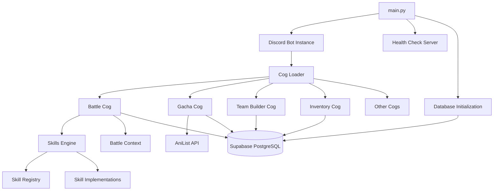

## Overview

Project Stardust is a Discord bot built with discord.py that features an anime character gacha system, team-based battles, raids, and RPG progression mechanics. The bot uses a modular cog-based architecture for extensibility and maintainability.

## Architecture Diagram



## Core Components

### Main Entry Point

The bot's entry point is `main.py:43`, which orchestrates the startup sequence:

```python
async def main():
    if not TOKEN:
        print("❌ CRITICAL ERROR: DISCORD_TOKEN not found.")
        return

    try:
        # Start the web server in the background for Render
        asyncio.create_task(start_web_server())

        # Initialize Supabase tables
        print("🗄️  Connecting to Supabase...")
        await init_db()

        # Load Cogs
        print("⚙️  Loading Modules...")
        if os.path.exists('./cogs'):
            for filename in os.listdir('./cogs'):
                if filename.endswith('.py'):
                    try:
                        await bot.load_extension(f'cogs.{filename[:-3]}')
                        print(f"   ✅ Loaded: {filename}")
                    except Exception as e:
                        print(f"   ❌ Failed to load {filename}: {e}")

        # Start Bot
        async with bot:
            await bot.start(TOKEN)
    finally:
        # Cleanup database pool on shutdown
        print("🔄 Closing database connections...")
        await close_db_pool()
```

Key startup steps:

1. **Health Check Server** (`main.py:20-34`) - Runs on port 8080 for deployment platforms
2. **Database Initialization** (`main.py:54`) - Creates all tables if they don't exist
3. **Cog Loading** (`main.py:57-65`) - Dynamically loads all modules from `cogs/` directory
4. **Bot Start** (`main.py:68-69`) - Connects to Discord and begins event loop

### Cog System

Project Stardust uses discord.py's cog system to organize functionality into modules. Each cog is a self-contained feature:

#### Available Cogs

- **achievements.py** - Achievement tracking and rewards
- **admin.py** - Administrative commands and bot management
- **battle.py** - Team-based PvP and PvE combat system
- **bounty.py** - Daily bounty board missions
- **buy.py** - In-app purchase integration
- **daily.py** - Daily login rewards and tasks
- **event.py** - Special timed events
- **expedition.py** - Passive gem generation system
- **gacha.py** - Character summoning with banners
- **help.py** - Command documentation
- **inventory.py** - Character collection management
- **raid.py** - Multi-phase boss battles
- **rpg.py** - Story mode and NPC battles
- **shop.py** - Daily rotating shop
- **teambuilder.py** - Interactive team composition UI
- **utility.py** - Miscellaneous utility commands

#### Cog Structure

Each cog follows this pattern:

```python
from discord.ext import commands

class MyCog(commands.Cog):
    def __init__(self, bot):
        self.bot = bot
    
    @commands.command(name="mycommand")
    async def my_command(self, ctx):
        # Command logic here
        pass

async def setup(bot):
    await bot.add_cog(MyCog(bot))
```

### Database Layer

The bot uses asyncpg for PostgreSQL database operations with connection pooling:

```python
# core/database.py:9
async def get_db_pool():
    global _pool
    if _pool is None:
        _pool = await asyncpg.create_pool(
            DATABASE_URL,
            min_size=1,         # Start with 1 connection
            max_size=3,         # Conservative: max 3 connections
            command_timeout=60,
            max_cached_statement_lifetime=0,
            timeout=30,
            max_queries=50000,
            max_inactive_connection_lifetime=300
        )
    return _pool
```

Key database functions:

- `get_db_pool()` - Returns the connection pool singleton
- `init_db()` - Creates all tables and schema
- `get_user(user_id)` - Fetches or creates a user record
- `batch_add_to_inventory()` - Efficiently adds multiple characters
- `batch_cache_characters()` - Caches AniList data

### Skills System

The skills system is the most complex component, handling battle abilities. It consists of three parts:

#### 1. Skill Registry (`core/skills/registry.py`)

Defines all skills with metadata:

```python
SKILL_DATA = {
    "Surge": {
        "description": "Bonus 25% to character power.",
        "value": 0.25,
        "applies_in": "b",  # b=battle, e=expedition, g=global
        "stackable": False,
        "overlap": False,
        "class": SimpleBuffSkill
    },
    # ... more skills
}
```

#### 2. Battle Context (`core/skills/engine.py`)

Manages battle state:

```python
class BattleContext:
    def __init__(self, attacker_team, defender_team):
        self.teams = {"attacker": attacker_team, "defender": defender_team}
        self.logs = {"attacker": {}, "defender": {}}
        self.suppressed = {"attacker": set(), "defender": set()}
        self.multipliers = {"attacker": {}, "defender": {}}
        self.flat_bonuses = {"attacker": {}, "defender": {}}
        self.flags = {}  # For custom skill data
```

#### 3. Skill Implementations (`core/skills/implementations.py`)

Contains skill logic with lifecycle hooks:

```python
class BattleSkill:
    async def on_battle_start(self, ctx: BattleContext):
        """Phase 1: Pre-battle setup, disable skills, apply debuffs"""
        pass
    
    async def get_power_modifier(self, ctx: BattleContext, current_base_power):
        """Phase 2: Returns power multiplier for this unit"""
        return 1.0
    
    async def on_post_power_calculation(self, ctx: BattleContext, final_powers):
        """Phase 3: Modify final power values after calculation"""
        pass
    
    async def on_battle_end(self, ctx: BattleContext, final_powers, result):
        """Phase 4: Handle outcome, can trigger retries or reversals"""
        return None  # or "RETRY" or "WIN"/"LOSS"
```

### Battle Flow

The battle system (`cogs/battle.py:76`) orchestrates combat:

```python
# 1. Initialize Context
battle_ctx = BattleContext(attacker_team, defender_team)

# 2. Load Skills
all_skills = []
for team, side in [(attacker_team, "attacker"), (defender_team, "defender")]:
    for i, char in enumerate(team):
        for tag in char.get('ability_tags', []):
            skill = create_skill_instance(tag, char, i, side)
            if skill: all_skills.append(skill)

# 3. Phase: Battle Start
for skill in sorted(all_skills, key=lambda s: s.priority, reverse=True):
    await skill.on_battle_start(battle_ctx)

# 4. Phase: Power Calculation
for side in ["attacker", "defender"]:
    for i, char in enumerate(team):
        p = char['true_power']
        for skill in my_skills:
            p *= await skill.get_power_modifier(battle_ctx, p)
        p *= battle_ctx.multipliers[side][i]
        p += battle_ctx.flat_bonuses[side][i]
        final_powers[side].append(p * variance)

# 5. Phase: Post-Calculation
for skill in all_skills:
    await skill.on_post_power_calculation(battle_ctx, final_powers)

# 6. Determine Winner
outcome = "WIN" if sum(final_powers["attacker"]) > sum(final_powers["defender"]) else "LOSS"

# 7. Phase: End Hooks (with retry support)
for skill in all_skills:
    decision = await skill.on_battle_end(battle_ctx, final_powers, outcome)
    if decision == "RETRY":
        # Restart from step 4
```

## Configuration

Environment variables (`.env` file):

```bash
DISCORD_TOKEN=your_bot_token
DATABASE_URL=postgresql://...
COMMAND_PREFIX=!  # Default prefix
PORT=8080  # Health check server port
ANILIST_URL=https://graphql.anilist.co
```

## Deployment

The bot includes a health check endpoint (`main.py:22-23`) for platforms like Render:

```python
async def health_check(request):
    return web.Response(text="Stardust is Online!")
```

This prevents the hosting platform from shutting down the bot due to inactivity.

## Performance Considerations

### Connection Pooling

The database uses a conservative pool size (1-3 connections) to work within Supabase free tier limits:

```python
# core/database.py:15-18
_pool = await asyncpg.create_pool(
    DATABASE_URL,
    min_size=1,
    max_size=3,  # Conservative for free tier
    # ...
)
```

### Image Generation

Battle and gacha results use PIL for dynamic image generation, reducing reliance on external APIs.

### Caching

Character data from AniList is cached in `characters_cache` table to minimize API calls:

```python
# core/database.py:317
async def batch_cache_characters(chars):
    # Only updates if is_overridden = FALSE
    await pool.executemany("""
        INSERT INTO characters_cache (...)
        ON CONFLICT (anilist_id) DO UPDATE 
        SET true_power = EXCLUDED.true_power,
            rarity = EXCLUDED.rarity
        WHERE characters_cache.is_overridden = FALSE
    """, data)
```

## Error Handling

Cogs use try-except blocks with user-friendly error messages:

```python
try:
    await bot.load_extension(f'cogs.{filename[:-3]}')
    print(f"   ✅ Loaded: {filename}")
except Exception as e:
    print(f"   ❌ Failed to load {filename}: {e}")
```

## Next Steps

- [Database Schema](/technical/database) - Complete table structure
- [Skills System](/technical/skills-system) - Detailed skill mechanics
- [API Reference](/api-reference) - Command documentation