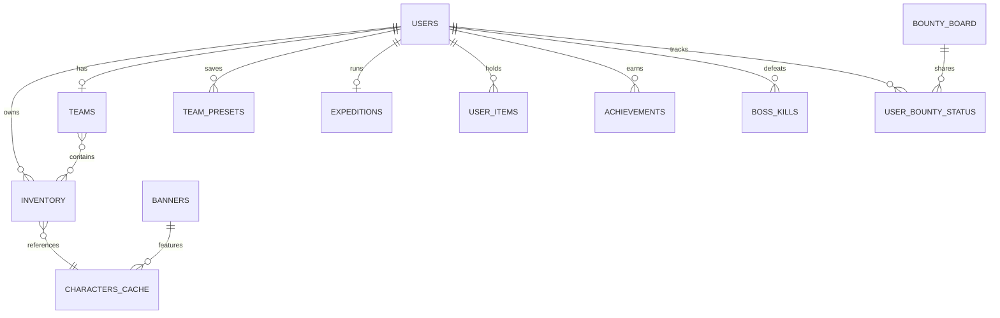

## Overview

Project Stardust uses PostgreSQL (via Supabase) with asyncpg for async database operations. The schema supports gacha mechanics, team building, progression systems, and social features.

## Database Initialization

All tables are created in `core/database.py:34` via the `init_db()` function:

```python
async def init_db():
    pool = await get_db_pool()
    async with pool.acquire() as conn:
        # Create all tables...
```

## Entity Relationship Diagram



## Core Tables

### users

Central table tracking player resources and progression.

```sql
CREATE TABLE IF NOT EXISTS users (
    user_id TEXT PRIMARY KEY,
    gacha_gems INTEGER DEFAULT 0,
    coins INTEGER DEFAULT 0,
    boat_credits_spent BIGINT DEFAULT 0,
    pity_counter INTEGER DEFAULT 0,
    luck_boost_stacks INTEGER DEFAULT 0,
    last_daily_exchange TIMESTAMP WITH TIME ZONE,
    last_expedition_claim TIMESTAMP WITH TIME ZONE,
    daily_boat_pulls INTEGER DEFAULT 0,
    last_boat_pull_at TIMESTAMP WITH TIME ZONE DEFAULT CURRENT_TIMESTAMP,
    has_claimed_starter BOOLEAN DEFAULT FALSE,
    banner_points INTEGER DEFAULT 0,
    last_banner_id INTEGER DEFAULT -1,
    team_level INTEGER DEFAULT 1,
    team_xp INTEGER DEFAULT 0,
    total_pulls INTEGER DEFAULT 0,
    total_bounties INTEGER DEFAULT 0,
    expedition_gems_total INTEGER DEFAULT 0,
    total_scrapped INTEGER DEFAULT 0,
    checkin_streak INTEGER DEFAULT 0,
    bounty_keys INTEGER DEFAULT 3,
    last_key_regen TIMESTAMP WITH TIME ZONE DEFAULT CURRENT_TIMESTAMP
)
```

**Location:** `core/database.py:73-85`

**Key Columns:**

- `gacha_gems` - Premium currency for summoning
- `coins` - Secondary currency for shop purchases
- `pity_counter` - Tracks pulls until guaranteed SSR
- `banner_points` - Spark system progress (resets on banner change)
- `team_level` - Applies 1% power boost per level to entire team
- `bounty_keys` - Daily mission resource (max 3, regenerates)

**Added Dynamically:** `core/database.py:87-106`

### inventory

Stores each player's character collection with dupe tracking.

```sql
CREATE TABLE IF NOT EXISTS inventory (
    id SERIAL PRIMARY KEY,
    user_id TEXT REFERENCES users(user_id),
    anilist_id INTEGER,
    dupe_level INTEGER DEFAULT 0,
    obtained_at TIMESTAMP DEFAULT CURRENT_TIMESTAMP,
    is_locked BOOLEAN DEFAULT FALSE,
    bond_exp INTEGER DEFAULT 0,
    bond_level INTEGER DEFAULT 1,
    UNIQUE(user_id, anilist_id)
)
```

**Location:** `core/database.py:154-164`

**Key Columns:**

- `dupe_level` - Duplicate count (0-10), each dupe adds +5% power
- `bond_level` - Character affinity, adds +0.5% power per level
- `is_locked` - Protection from mass scrapping
- `UNIQUE(user_id, anilist_id)` - One row per character per player

**Power Calculation:**

```python
# cogs/battle.py:34-40
FLOOR(
    c.true_power 
    * (1 + (COALESCE(i.dupe_level, 0) * 0.05))  # Dupes: +5% each
    * (1 + (COALESCE(u.team_level, 1) * 0.01))  # Team Level: +1% each
    * (1 + (COALESCE(i.bond_level, 1) * 0.005)) # Bond: +0.5% each
) as true_power
```

### characters_cache

Caches AniList character data to reduce API calls.

```sql
CREATE TABLE IF NOT EXISTS characters_cache (
    anilist_id INTEGER PRIMARY KEY,
    name TEXT,
    image_url TEXT,
    rarity TEXT DEFAULT 'R',
    rank INTEGER DEFAULT 10000,
    base_power INTEGER DEFAULT 0,
    true_power INTEGER DEFAULT 0,
    ability_tags JSONB DEFAULT '[]'::jsonb,
    squash_resistance FLOAT DEFAULT 0.0,
    is_overridden BOOLEAN DEFAULT FALSE
)
```

**Location:** `core/database.py:217-230`

**Key Columns:**

- `rarity` - SSR (1-250), SR (251-1500), R (1501-10000) based on rank
- `rank` - AniList favorites ranking
- `true_power` - Calculated from favorites using `calculate_effective_power()`
- `ability_tags` - JSON array of skill names (e.g. `["Surge", "Guard"]`)
- `is_overridden` - When TRUE, prevents auto-updates from batch cache

**Update Behavior:** `core/database.py:323-328`

```python
ON CONFLICT (anilist_id) DO UPDATE 
SET true_power = EXCLUDED.true_power,
    rarity = EXCLUDED.rarity
WHERE characters_cache.is_overridden = FALSE
```

## Team System

### teams

Active team composition (5 character slots).

```sql
CREATE TABLE IF NOT EXISTS teams (
    user_id TEXT PRIMARY KEY REFERENCES users(user_id),
    slot_1 INTEGER DEFAULT NULL,
    slot_2 INTEGER DEFAULT NULL,
    slot_3 INTEGER DEFAULT NULL,
    slot_4 INTEGER DEFAULT NULL,
    slot_5 INTEGER DEFAULT NULL
)
```

**Location:** `core/database.py:181-190`

**Schema:**

- Each `slot_X` stores an `inventory.id` (NOT anilist_id)
- Slots can be NULL (empty)
- One team per user

### team_presets

Saved team loadouts for quick switching.

```sql
CREATE TABLE IF NOT EXISTS team_presets (
    user_id TEXT,
    preset_name TEXT,
    slot_1 INTEGER,
    slot_2 INTEGER,
    slot_3 INTEGER,
    slot_4 INTEGER,
    slot_5 INTEGER,
    PRIMARY KEY (user_id, preset_name)
)
```

**Location:** `core/database.py:193-204`

## Gacha System

### banners

Timed rate-up events.

```sql
CREATE TABLE IF NOT EXISTS banners (
    id SERIAL PRIMARY KEY,
    name TEXT NOT NULL,
    rate_up_ids INTEGER[] NOT NULL,
    rate_up_chance FLOAT DEFAULT 0.5,
    spark_pity INTEGER DEFAULT 300,
    is_active BOOLEAN DEFAULT FALSE,
    end_timestamp BIGINT NOT NULL
)
```

**Location:** `core/database.py:60-70`

**Key Columns:**

- `rate_up_ids` - Array of anilist_ids with boosted rates
- `rate_up_chance` - Probability of featured character (0.5 = 50%)
- `spark_pity` - Points needed to guarantee a featured unit
- `end_timestamp` - Unix timestamp for auto-expiration

## Progression Systems

### expeditions

Passive gem generation.

```sql
CREATE TABLE IF NOT EXISTS expeditions (
    user_id TEXT PRIMARY KEY REFERENCES users(user_id),
    slot_ids INTEGER[] DEFAULT '{}',
    start_time TIMESTAMP,
    last_claim TIMESTAMP
)
```

**Location:** `core/database.py:207-214`

**Mechanics:**

- `slot_ids` - Array of inventory IDs deployed
- Earns gems based on time elapsed and character skills
- Skills like "Hardworker" (+15%) and "Master of Coin" (+10%) stack

### daily_tasks

Daily mission progress tracking.

```sql
CREATE TABLE IF NOT EXISTS daily_tasks (
    user_id TEXT,
    task_key TEXT,
    progress INTEGER DEFAULT 0,
    is_claimed BOOLEAN DEFAULT FALSE,
    last_updated DATE DEFAULT CURRENT_DATE,
    PRIMARY KEY (user_id, task_key)
)
```

**Location:** `core/database.py:233-242`

**Task Keys:** `easy`, `normal`, `hard`, `expert`, `nightmare`, `hell`, `pvp`

### achievements

Permanent achievement unlocks.

```sql
CREATE TABLE IF NOT EXISTS achievements (
    user_id TEXT,
    achievement_id TEXT,
    earned_at TEXT,
    PRIMARY KEY (user_id, achievement_id)
)
```

**Location:** `core/database.py:49-56`

### boss_kills

Tracks special boss victories.

```sql
CREATE TABLE IF NOT EXISTS boss_kills (
    user_id TEXT,
    boss_id TEXT,
    PRIMARY KEY (user_id, boss_id)
)
```

**Location:** `core/database.py:40-46`

**Usage:** `cogs/battle.py:246-253` - Records kills against special user ID `1463071276036788392`

## Economy

### user_items

Item inventory (tokens, consumables, etc.).

```sql
CREATE TABLE IF NOT EXISTS user_items (
    user_id TEXT,
    item_id TEXT,
    quantity INTEGER DEFAULT 0,
    PRIMARY KEY (user_id, item_id)
)
```

**Location:** `core/database.py:132-139`

### daily_shop

Rotating daily shop inventory.

```sql
CREATE TABLE IF NOT EXISTS daily_shop (
    date TEXT PRIMARY KEY,
    items JSONB
)
```

**Location:** `core/database.py:143-148`

**Schema:**

- `date` - YYYY-MM-DD format
- `items` - JSON array: `[{id, price, rarity}, ...]`

## Bounty Board System

### bounty_board

Shared server-wide bounty missions.

```sql
CREATE TABLE IF NOT EXISTS bounty_board (
    slot_id INTEGER PRIMARY KEY,
    enemy_data JSONB,
    tier TEXT,
    expires_at TIMESTAMP
)
```

**Location:** `core/database.py:109-116`

**Key Columns:**

- `slot_id` - Board position (e.g. 1-5)
- `enemy_data` - JSON object with enemy stats
- `tier` - Difficulty level
- `expires_at` - Auto-refresh timestamp

### user_bounty_status

Tracks individual completion per slot.

```sql
CREATE TABLE IF NOT EXISTS user_bounty_status (
    user_id TEXT,
    slot_id INTEGER,
    status TEXT, -- 'AVAILABLE', 'COMPLETED', 'FAILED'
    PRIMARY KEY (user_id, slot_id)
)
```

**Location:** `core/database.py:119-126`

## Global Settings

### global_settings

Server-wide feature toggles.

```sql
CREATE TABLE IF NOT EXISTS global_settings (
    key TEXT PRIMARY KEY,
    value_bool BOOLEAN DEFAULT TRUE
)
```

**Location:** `core/database.py:245-250`

## Helper Functions

### get_user(user_id)

Fetches or creates user record.

```python
# core/database.py:254-260
async def get_user(user_id):
    pool = await get_db_pool()
    async with pool.acquire() as conn:
        row = await conn.fetchrow(
            "SELECT * FROM users WHERE user_id = $1", str(user_id)
        )
        if row: return dict(row)
        await conn.execute(
            "INSERT INTO users (user_id) VALUES ($1)", str(user_id)
        )
        return dict(await conn.fetchrow(
            "SELECT * FROM users WHERE user_id = $1", str(user_id)
        ))
```

### batch_add_to_inventory(user_id, characters)

Adds characters with auto-scrapping.

```python
# core/database.py:266-315
async def batch_add_to_inventory(user_id, characters):
    """
    Adds characters to inventory. Increments dupe_level up to 10.
    If already at 10, scraps the character for gems AND COINS.
    Returns (total_gems, total_coins).
    """
    scrap_values = {"R": 100, "SR": 500, "SSR": 10000}
    scrap_coins_values = {"R": 5, "SR": 25, "SSR": 500}
    
    for char in characters:
        row = await conn.fetchrow(
            "SELECT dupe_level FROM inventory WHERE user_id = $1 AND anilist_id = $2",
            str(user_id), cid
        )
        
        if not row:
            # New character
            await conn.execute(
                "INSERT INTO inventory (user_id, anilist_id, dupe_level) VALUES ($1, $2, 0)"
            )
        elif row['dupe_level'] < 10:
            # Increment dupe
            await conn.execute(
                "UPDATE inventory SET dupe_level = dupe_level + 1 WHERE ..."
            )
        else:
            # Max dupes: auto-scrap
            total_scrapped_gems += scrap_values.get(rarity, 0)
            total_scrapped_coins += scrap_coins_values.get(rarity, 0)
```

### get_inventory_details(user_id, sort_by="date")

Retrieves full inventory with calculated power.

```python
# core/database.py:331-354
SELECT 
    i.id, 
    i.anilist_id, 
    c.name, 
    FLOOR(c.true_power * (1 + (i.dupe_level * 0.05))) as true_power,
    c.rarity, 
    c.rank, 
    i.dupe_level + 1 as dupe_count
FROM inventory i
LEFT JOIN characters_cache c ON i.anilist_id = c.anilist_id
WHERE i.user_id = $1
ORDER BY i.obtained_at DESC -- or true_power DESC
```

### mass_scrap_r_rarity(user_id) / mass_scrap_sr_rarity(user_id)

Bulk scrap operations.

```python
# core/database.py:380-410
DELETE FROM inventory
WHERE user_id = $1 
AND is_locked = FALSE
AND anilist_id IN (
    SELECT anilist_id FROM characters_cache WHERE rarity = 'R'
)
RETURNING id
```

**Returns:** `(count, gems, coins)`

- R: 100 gems + 5 coins each
- SR: 500 gems + 25 coins each

## Migration Pattern

Dynamic column additions use `ALTER TABLE ... ADD COLUMN IF NOT EXISTS`:

```python
# core/database.py:87-92
await conn.execute(
    "ALTER TABLE users ADD COLUMN IF NOT EXISTS banner_points INTEGER DEFAULT 0;"
)
await conn.execute(
    "ALTER TABLE users ADD COLUMN IF NOT EXISTS last_banner_id INTEGER DEFAULT -1;"
)
```

Constraints use guards:

```python
# core/database.py:171-178
await conn.execute("""
    DO $$ 
    BEGIN 
        IF NOT EXISTS (SELECT 1 FROM pg_constraint WHERE conname = 'unique_user_character') THEN
            ALTER TABLE inventory ADD CONSTRAINT unique_user_character UNIQUE (user_id, anilist_id);
        END IF;
    END $$;
""")
```

## Best Practices

### Connection Management

Always use connection pool:

```python
pool = await get_db_pool()
async with pool.acquire() as conn:
    # Your queries here
```

### Parameterized Queries

Prevent SQL injection:

```python
# Good
await conn.execute("SELECT * FROM users WHERE user_id = $1", user_id)

# Bad
await conn.execute(f"SELECT * FROM users WHERE user_id = '{user_id}'")
```

### Transactions

Group related operations:

```python
async with conn.transaction():
    await conn.execute("DELETE FROM inventory WHERE id = $1", inv_id)
    await conn.execute("UPDATE users SET gacha_gems = gacha_gems + 200")
```

## Next Steps

- [Bot Architecture](/technical/architecture) - Overall system design
- [Skills System](/technical/skills-system) - Battle mechanics
- [Commands Reference](/api-reference) - User-facing documentation