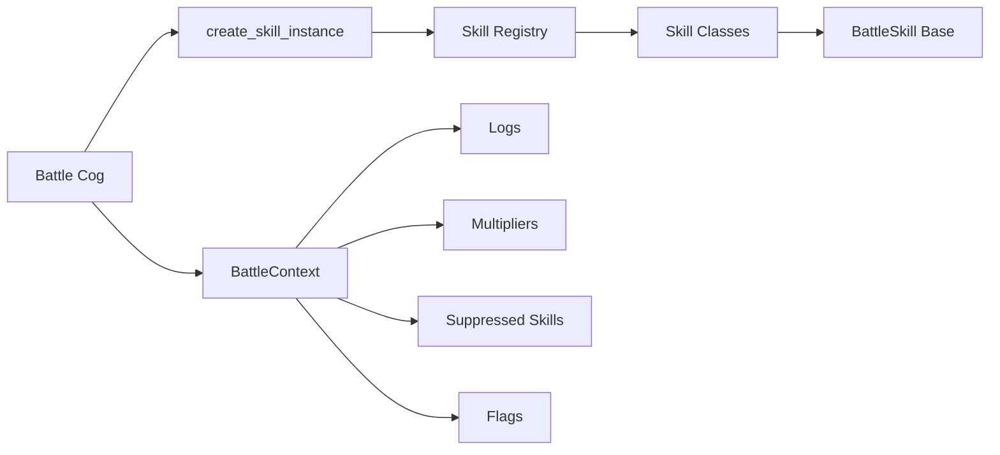

## Overview

The skills system powers Project Stardust's battle mechanics. It's a modular, extensible framework that supports:

- **70+ unique skills** with diverse effects
- **4-phase battle lifecycle** (Start → Power Calc → Post-Calc → End)
- **Skill interactions** (synergies, suppressions, conditional buffs)
- **Retry mechanics** (skills can rewind battles)
- **Priority system** (determines execution order)

## Architecture

### System Components



### File Structure

```
core/skills/
├── __init__.py
├── engine.py              # BattleContext & BattleSkill base class
├── registry.py            # SKILL_DATA dictionary & factory
└── implementations.py     # All skill class implementations
```

## Core Classes

### BattleContext

Manages all battle state. Located in `core/skills/engine.py:1`.

```python
class BattleContext:
    def __init__(self, attacker_team, defender_team):
        # Team Data
        self.teams = {
            "attacker": attacker_team,
            "defender": defender_team
        }
        
        # Combat Logs (organized by [Side][SlotIndex])
        self.logs = {
            "attacker": {i: [] for i in range(5)},
            "defender": {i: [] for i in range(5)}
        }
        self.misc_logs = {"attacker": [], "defender": []}
        
        # Skill Suppression
        self.suppressed = {"attacker": set(), "defender": set()}
        
        # Power Modifiers
        self.multipliers = {
            "attacker": {i: 1.0 for i in range(5)},
            "defender": {i: 1.0 for i in range(5)}
        }
        
        # Flat Power Bonuses (applied after multipliers)
        self.flat_bonuses = {
            "attacker": {i: 0 for i in range(5)},
            "defender": {i: 0 for i in range(5)}
        }
        
        # Global Flags (for skill-specific data)
        self.flags = {}
```

**Key Methods:**

```python
def add_log(self, side, idx, message):
    """Adds a battle log entry"""
    self.logs[side][idx].append(message)

def suppress_skill(self, target_side, skill_name):
    """Disables a skill for the remainder of battle"""
    self.suppressed[target_side].add(skill_name)

def is_suppressed(self, side, skill_name):
    """Checks if skill is currently disabled"""
    return skill_name in self.suppressed[side]
```

### BattleSkill (Base Class)

Abstract base for all skills. Located in `core/skills/engine.py:58`.

```python
class BattleSkill:
    def __init__(self, name, owner_data, owner_idx, side, config_value):
        self.name = name
        self.owner = owner_data      # Character dict
        self.idx = owner_idx         # Slot index (0-4)
        self.side = side             # "attacker" or "defender"
        self.val = config_value      # Value from SKILL_DATA
        self.enemy_side = "defender" if side == "attacker" else "attacker"
        self.priority = getattr(self.__class__, 'priority', 0)
    
    async def on_battle_start(self, ctx: BattleContext):
        """Phase 1: Pre-battle setup"""
        pass
    
    async def get_power_modifier(self, ctx: BattleContext, current_base_power):
        """Phase 2: Returns power multiplier"""
        return 1.0
    
    async def on_post_power_calculation(self, ctx: BattleContext, final_powers):
        """Phase 3: Modify final power values"""
        pass
    
    async def on_battle_end(self, ctx: BattleContext, final_powers, result):
        """Phase 4: Handle outcome, can return RETRY/WIN/LOSS"""
        return None
```

## Battle Lifecycle

### Phase 1: Battle Start

Executed **once per battle** (or retry) in priority order.

**Location:** `cogs/battle.py:128-129`

```python
all_skills.sort(key=lambda s: s.priority, reverse=True)
for skill in all_skills:
    await skill.on_battle_start(battle_ctx)
```

**Use Cases:**

- Disable enemy skills (Onyx Moon, Zodiac Pig)
- Apply team-wide buffs/debuffs (Guard, Ephemerality)
- Trigger random effects (Queen of the Zodiacs)
- Sacrifice mechanics (Kamikaze, Griffith)

**Example:**

```python
# core/skills/implementations.py:614
class GuardSkill(BattleSkill):
    async def on_battle_start(self, ctx: BattleContext):
        if ctx.is_suppressed(self.side, self.name): 
            return
        
        # Prevent stacking
        if ctx.flags.get(f"guard_active_{self.side}"):
            return
        ctx.flags[f"guard_active_{self.side}"] = True
        
        # Apply -10% to all enemies
        debuff_mult = 1.0 - self.val  # 0.90
        for i in range(5):
            ctx.multipliers[self.enemy_side][i] *= debuff_mult
        
        ctx.add_log(self.side, self.idx, f"🛡️ **Guard** activated (-10% Enemy Power)!")
```

### Phase 2: Power Calculation

Executed **per character** to determine final power.

**Location:** `cogs/battle.py:153-176`

```python
for side in ["attacker", "defender"]:
    for i, char in enumerate(team):
        if not char:
            final_powers[side].append(0)
            continue
        
        p = char['true_power']
        
        # Apply skill modifiers
        my_skills = [s for s in all_skills if s.side == side and s.idx == i]
        for s in my_skills:
            mod = await s.get_power_modifier(battle_ctx, p)
            p *= mod
        
        # Apply context multipliers
        p *= battle_ctx.multipliers[side][i]
        p += battle_ctx.flat_bonuses[side][i]
        
        # Apply variance (0.9 - 1.1, or overridden)
        if battle_ctx.flags.get("variance_override", {}).get(f"{side}_{i}"):
            variance = battle_ctx.flags["variance_override"][f"{side}_{i}"]
        else:
            variance = random.uniform(0.9, 1.1)
        
        final_powers[side].append(max(0, p * variance))
```

**Use Cases:**

- Simple buffs (Surge, Berserk)
- Conditional buffs (Amber Sun, Eternity)
- Probabilistic effects (Lucky 7, Joker)

**Example:**

```python
# core/skills/implementations.py:62
class Lucky7Skill(BattleSkill):
    async def get_power_modifier(self, ctx: BattleContext, current_power):
        if ctx.is_suppressed(self.side, self.name):
            return 1.0
        
        if random.random() < 0.07:  # 7% chance
            ctx.add_log(self.side, self.idx, f"✨ Lucky 7 Jackpot (+777% Power)!")
            return 8.77  # Original * 8.77 = +777%
        elif random.random() < 0.77:  # 77% chance
            ctx.add_log(self.side, self.idx, f"🍀 Lucky 7 flat bonus (+7,777)!")
            ctx.flat_bonuses[self.side][self.idx] += 7777
        
        return 1.0
```

### Phase 3: Post-Calculation

Executed **after base calculations** but before summation.

**Location:** `cogs/battle.py:179-180`

```python
for skill in all_skills:
    await skill.on_post_power_calculation(battle_ctx, final_powers)
```

**Use Cases:**

- Power swapping (Zodiac Monkey)
- Power copying (Zodiac Dog)
- Fixed power overrides (Zodiac Sheep)
- Conditional cleanses (Casca's Runaway)

**Example:**

```python
# core/skills/implementations.py:856
class ZodiacSkill(BattleSkill):
    async def on_post_power_calculation(self, ctx: BattleContext, final_powers):
        effects = [e for e in ctx.flags.get("zodiac_post_effects", []) 
                   if e["side"] == self.side and e["idx"] == self.idx]
        
        for eff in effects:
            if eff["type"] == "Sheep":
                # Copy opponent's max power to self
                opp_powers = final_powers[self.enemy_side]
                if opp_powers:
                    final_powers[self.side][self.idx] = max(opp_powers)
            
            elif eff["type"] == "Monkey":
                # Swap with random opponent
                opp_indices = [i for i, p in enumerate(final_powers[self.enemy_side]) if p > 0]
                if opp_indices:
                    target = random.choice(opp_indices)
                    my_val = final_powers[self.side][self.idx]
                    opp_val = final_powers[self.enemy_side][target]
                    final_powers[self.side][self.idx] = opp_val
                    final_powers[self.enemy_side][target] = my_val
```

### Phase 4: Battle End

Executed **after winner is determined**.

**Location:** `cogs/battle.py:195-209`

```python
outcome = "WIN" if final_team_totals["attacker"] > final_team_totals["defender"] else "LOSS"

for skill in all_skills:
    decision = await skill.on_battle_end(battle_ctx, final_powers, outcome)
    if decision == "RETRY":
        retry_requested = True
        break
    elif decision:  # "WIN" or "LOSS" override
        outcome = decision
        break
```

**Use Cases:**

- Outcome reversal (Revive)
- Battle retry (The Almighty)

**Example:**

```python
# core/skills/implementations.py:944
class ReviveSkill(BattleSkill):
    async def on_battle_end(self, ctx, final_powers, result):
        if result == "LOSS":
            if random.random() < self.val:  # 25% chance
                ctx.add_log(self.side, self.idx, f"💖 **Revive** triggered! LOSS → WIN.")
                return "WIN"
        return None
```

## Skill Registry

### SKILL_DATA Dictionary

Central skill configuration in `core/skills/registry.py:10`.

```python
SKILL_DATA = {
    "Surge": {
        "description": "Bonus 25% to character power.",
        "value": 0.25,
        "applies_in": "b",  # b=battle, e=expedition, g=global
        "stackable": False,
        "overlap": False,
        "class": SimpleBuffSkill
    },
    "Lucky 7": {
        "description": "7% chance of +777% power; 77% chance of +7,777 flat power.",
        "value": 7.77,
        "applies_in": "b",
        "stackable": False,
        "overlap": False,
        "class": Lucky7Skill
    },
    # ... 70+ more skills
}
```

**Field Definitions:**

- `description` - User-facing tooltip text
- `value` - Numeric config (can be int, float, list, or dict)
- `applies_in` - Context: `"b"` (battle), `"e"` (expedition), `"g"` (global)
- `stackable` - Whether multiple instances can stack
- `overlap` - Whether same skill on different units stacks
- `class` - Python class implementing the logic

### Factory Function

```python
# core/skills/registry.py:233
def create_skill_instance(skill_name, owner_data, owner_idx, side):
    """Instantiates a skill class from the registry."""
    data = get_skill_info(skill_name)
    if not data: 
        return None
    
    if data['applies_in'] not in ['b', 'g']:
        return None  # Skip expedition-only skills
    
    klass = data.get("class")
    if not klass:
        return None
    
    return klass(skill_name, owner_data, owner_idx, side, data.get("value"))
```

## Skill Categories

### Simple Buffs

Basic power multipliers.

**Examples:** Surge (+25%), Berserk (25% chance for +50%), Golden Egg (1% chance for 3x)

**Implementation:** `core/skills/implementations.py:41`

```python
class SimpleBuffSkill(BattleSkill):
    async def get_power_modifier(self, ctx: BattleContext, current_power):
        if ctx.is_suppressed(self.side, self.name):
            return 1.0
        
        if self.name == "Surge":
            ctx.add_log(self.side, self.idx, f"⚡ **Surge** (+25%)!")
            return 1.25
        
        if self.name == "Berserk":
            if random.random() < 0.25:
                ctx.add_log(self.side, self.idx, f"💢 **Berserk** (+50%)!")
                return 1.50
        
        return 1.0
```

### Conditional Synergies

Require specific characters to activate.

**Examples:**

- **Amber Sun** - If Agott is present, both gain +15%
- **Eternity** - If Himmel is present, gain +18%
- **Feline Fealty** - If Tohru is present, both gain +10% and enemies lose -2.5%

**Implementation:** `core/skills/implementations.py:486`

```python
class AmberSunSkill(BattleSkill):
    async def get_power_modifier(self, ctx: BattleContext, current_power):
        if ctx.is_suppressed(self.side, self.name):
            return 1.0
        
        agott_id = self.val[0]  # 129842
        bonus = self.val[1]     # 0.15
        
        my_team = ctx.get_team(self.side)
        if any(c.get('anilist_id') == agott_id for c in my_team if c):
            ctx.add_log(self.side, self.idx, f"☀️ Resonated with Agott (+15%)!")
            return 1.0 + bonus
        
        return 1.0
```

### Team-Wide Effects

Affect multiple units.

**Examples:**

- **Guard** - Reduce all enemy power by 10%
- **Ephemerality** - If Frieren present, boost entire team by 6%
- **Queen of the Zodiacs (Tiger)** - Boost team by 5%

**Implementation:** `core/skills/implementations.py:425`

```python
class EphemeralitySkill(BattleSkill):
    async def on_battle_start(self, ctx: BattleContext):
        if ctx.is_suppressed(self.side, self.name):
            return
        
        frieren_id = self.val[0]  # 176754
        bonus = self.val[1]       # 0.06
        my_team = ctx.get_team(self.side)
        
        if any(c.get('anilist_id') == frieren_id for c in my_team if c):
            for i in range(len(my_team)):
                ctx.multipliers[self.side][i] *= (1.0 + bonus)
            ctx.add_log(self.side, self.idx, f"🌿 Frieren's presence boosted the party!")
```

### Skill Suppression

Disable enemy skills.

**Examples:**

- **Onyx Moon** - Disables 1 random enemy skill
- **Zodiac (Pig)** - Disables 1 random enemy skill
- **The Almighty** - Suppresses all ally skills (self-sacrifice)

**Implementation:** `core/skills/implementations.py:547`

```python
class OnyxMoonSkill(BattleSkill):
    priority = 10  # Executes early
    
    async def on_battle_start(self, ctx: BattleContext):
        enemy_team = ctx.get_team(self.enemy_side)
        
        # Find valid targets
        valid_targets = []
        for i, char in enumerate(enemy_team):
            if not char: continue
            tags = char.get('ability_tags', [])
            for tag in tags:
                # Exempt protected skills
                if tag not in ["Queen of the Zodiacs", "The Onyx Moon", "The Almighty"]:
                    valid_targets.append((i, tag))
        
        if not valid_targets:
            return
        
        target_idx, target_skill = random.choice(valid_targets)
        ctx.suppress_skill(self.enemy_side, target_skill)
        
        ctx.add_log(self.side, self.idx, f"🌑 **Umbra** silenced **{target_skill}**!")
```

### Sacrifice Mechanics

Self-destruction for strategic advantage.

**Examples:**

- **Kamikaze** - Sacrifice self to eliminate 1 random enemy
- **The Absolute (Griffith)** - Sacrifice all allies (except Guts) to massively buff him

**Implementation:** `core/skills/implementations.py:601`

```python
class KamikazeSkill(BattleSkill):
    async def on_battle_start(self, ctx: BattleContext):
        if ctx.is_suppressed(self.side, self.name):
            return
        
        enemy_team = ctx.get_team(self.enemy_side)
        valid_targets = [i for i, c in enumerate(enemy_team) 
                         if c and ctx.multipliers[self.enemy_side][i] > 0]
        
        if valid_targets:
            target_idx = random.choice(valid_targets)
            ctx.multipliers[self.enemy_side][target_idx] = 0.0
            ctx.add_log(self.side, self.idx, 
                f"💥 **Kamikaze** eliminated **{enemy_team[target_idx]['name']}**!")
```

### Advanced Mechanics

#### The Almighty (Yhwach)

Most complex skill with retry logic.

**Location:** `core/skills/implementations.py:87`

**Features:**

1. **Auswählen** - Suppresses all ally skills (except Jugram), reduces their power by 40%
2. **Absorption** - Gains +10% power (+0.5% per dupe) per suppressed skill
3. **Rewrite Future** - If defeated, retries battle (max 5 times, +1 per 2 dupes)
4. **Evolution** - Gains +25% power per retry

```python
class AlmightySkill(BattleSkill):
    priority = 11  # Executes first
    
    def __init__(self, *args, **kwargs):
        super().__init__(*args, **kwargs)
        self.cannot_be_suppressed = True
    
    async def on_battle_start(self, ctx: BattleContext):
        my_team = ctx.get_team(self.side)
        suppressed_count = 0
        dupes = self.owner.get("dupe_level", 0)
        per_stack_bonus = 0.10 + (min(dupes, 10) * 0.005)
        
        for i, char in enumerate(my_team):
            if not char or i == self.idx: continue
            
            # Spare Jugram
            is_jugram = "Jugram" in char.get("name", "") or "The Balance" in char.get('ability_tags', [])
            
            if not is_jugram:
                # Auswählen: -40% power
                ctx.multipliers[self.side][i] *= 0.6
                
                # Suppress skills
                for tag in char.get('ability_tags', []):
                    if not ctx.is_suppressed(self.side, tag):
                        ctx.suppress_skill(self.side, tag)
                        suppressed_count += 1
        
        if suppressed_count > 0:
            total_buff = suppressed_count * per_stack_bonus
            ctx.flags[f"{self.side}_{self.idx}_almighty_sac_buff"] = total_buff
    
    async def on_battle_end(self, ctx: BattleContext, final_powers, result):
        is_attacker = (self.side == "attacker")
        i_won = (result == "WIN") if is_attacker else (result == "LOSS")
        
        if i_won:
            return None  # Accept victory
        
        # Check retry budget
        dupes = self.owner.get("dupe_level", 0)
        max_retries = 5 + (dupes // 2)
        retries_used = ctx.flags.get(f"{self.side}_{self.idx}_retries_used", 0)
        
        if retries_used >= max_retries:
            return None  # Out of retries
        
        # Consume retry
        retries_used += 1
        ctx.flags[f"{self.side}_{self.idx}_retries_used"] = retries_used
        
        # Increment power stacks
        current_stacks = ctx.flags.get(f"{self.side}_{self.idx}_retry_stacks", 0)
        ctx.flags[f"{self.side}_{self.idx}_retry_stacks"] = current_stacks + 1
        
        ctx.add_log(self.side, self.idx, f"🌑 **The Almighty**: Future #{retries_used} rejected. Rewriting... (Power +25%)")
        
        return "RETRY"
```

#### The Balance (Jugram Haschwalth)

Nullifies variance and absorbs deviation.

**Location:** `core/skills/implementations.py:180`

```python
class BalanceSkill(BattleSkill):
    async def on_battle_start(self, ctx: BattleContext):
        if ctx.is_suppressed(self.side, self.name):
            return
        
        total_delta = 0.0
        
        if "variance_override" not in ctx.flags:
            ctx.flags["variance_override"] = {}
        
        # Nullify variance for ALL units
        for side in ["attacker", "defender"]:
            team = ctx.get_team(side)
            for i, char in enumerate(team):
                if not char: continue
                
                # Simulate roll
                simulated = random.uniform(0.9, 1.1)
                delta = abs(1.0 - simulated)
                total_delta += delta
                
                # Force 1.0
                ctx.flags["variance_override"][f"{side}_{i}"] = 1.0
        
        ctx.flags[f"{self.side}_{self.idx}_balance_harvest"] = total_delta
    
    async def get_power_modifier(self, ctx: BattleContext, current_power):
        # Only absorb if Yhwach is present
        my_team = ctx.get_team(self.side)
        has_yhwach = any("The Almighty" in char.get('ability_tags', []) 
                         for char in my_team if char)
        
        if has_yhwach:
            harvest = ctx.flags.get(f"{self.side}_{self.idx}_balance_harvest", 0.0)
            return 1.0 + harvest
        
        return 1.0
```

## Priority System

Skills execute in order of priority (highest first).

**Default:** `priority = 0`

**Custom Priorities:**

```python
class AlmightySkill(BattleSkill):
    priority = 11  # Executes first (suppresses others)

class OnyxMoonSkill(BattleSkill):
    priority = 10  # Executes early (to disable before they activate)

class CascaSkill(BattleSkill):
    priority = 3   # Executes before Griffith's sacrifice

class GriffithSkill(BattleSkill):
    priority = 2   # Executes after Casca checks positioning

class EntwinedSoulsSkill(BattleSkill):
    priority = 1   # Executes before generic Zodiac

class SidusTenebrosumSkill(BattleSkill):
    priority = -1  # Executes last (for logging)
```

**Sorting:** `cogs/battle.py:125`

```python
all_skills.sort(key=lambda s: s.priority, reverse=True)
```

## Suppression Rules

### Suppression Immunity

Some skills cannot be suppressed:

```python
class AlmightySkill(BattleSkill):
    def __init__(self, *args, **kwargs):
        super().__init__(*args, **kwargs)
        self.cannot_be_suppressed = True

class GutsSkill(BattleSkill):
    def __init__(self, *args, **kwargs):
        super().__init__(*args, **kwargs)
        self.cannot_be_suppressed = True
```

### Check Pattern

Always check suppression at the start of each phase:

```python
async def on_battle_start(self, ctx: BattleContext):
    if ctx.is_suppressed(self.side, self.name):
        return  # Exit early
    
    # Skill logic here
```

### Protected Skills

Certain skills are exempt from suppression by specific abilities:

```python
# Onyx Moon cannot suppress these
if tag not in ["Queen of the Zodiacs", "The Onyx Moon", "Entwined Souls", "The Almighty", "The Struggler"]:
    valid_targets.append((i, tag))
```

## Testing Skills

### Adding a New Skill

1. **Define in Registry** (`core/skills/registry.py`)

```python
SKILL_DATA["My New Skill"] = {
    "description": "Does something cool.",
    "value": 0.30,
    "applies_in": "b",
    "stackable": False,
    "overlap": False,
    "class": MyNewSkillClass
}
```

2. **Implement Class** (`core/skills/implementations.py`)

```python
class MyNewSkillClass(BattleSkill):
    async def get_power_modifier(self, ctx: BattleContext, current_power):
        if ctx.is_suppressed(self.side, self.name):
            return 1.0
        
        ctx.add_log(self.side, self.idx, f"✨ **My New Skill** activated!")
        return 1.0 + self.val  # +30% power
```

3. **Import in Registry**

```python
from .implementations import (
    SimpleBuffSkill, Lucky7Skill, MyNewSkillClass  # Add here
)
```

4. **Add to Character** (via admin command or database)

```sql
UPDATE characters_cache 
SET ability_tags = '["My New Skill"]'::jsonb 
WHERE anilist_id = 12345;
```

### Debug Logging

Add verbose logs during development:

```python
ctx.add_log(self.side, self.idx, f"🔍 DEBUG: current_power={current_power}, modifier={modifier}")
```

Logs appear in battle embed under "Attacker Highlights" or "Defender Highlights".

## Best Practices

### 1. Always Check Suppression

```python
if ctx.is_suppressed(self.side, self.name):
    return  # or return 1.0 for modifiers
```

### 2. Use Flags for State

Store temporary data in `ctx.flags`:

```python
ctx.flags[f"{self.side}_{self.idx}_my_data"] = value
```

### 3. Prevent Stacking When Needed

```python
flag_key = f"guard_active_{self.side}"
if ctx.flags.get(flag_key):
    return  # Already active
ctx.flags[flag_key] = True
```

### 4. Use Priority for Dependencies

If Skill A must run before Skill B, give A higher priority.

### 5. Handle None/Empty Gracefully

```python
my_team = ctx.get_team(self.side)
if any(c and c.get('anilist_id') == target_id for c in my_team if c):
    # ...
```

### 6. Log User-Friendly Messages

```python
ctx.add_log(self.side, self.idx, f"✨ **{self.owner['name']}** activated **{self.name}**!")
```

## Next Steps

- [Bot Architecture](/technical/architecture) - System overview
- [Database Schema](/technical/database) - Data structures
- [Battle Commands](/commands/battle) - User guide